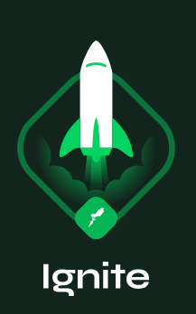

<h1 align="center">
    
</h1>

<h3 align="center">
   Módulos do Bootcamp Ignite
</h3>

  

  

---

## :rocket: Sobre este repositório

Este repositório consiste em armazenar os códigos produzidos durante os estudos dos módulos do bootcamp Ignite da [Rocketseat](http://www.rocketseat.com.br)

---

## :paperclip: Links

|    Níveis     |                                             Títulos                                             |
| :-----------: | :---------------------------------------------------------------------------------------------: |
| **Chapter I** | [Fundamentos do ReactJS](https://github.com/felipersdf/ignite/tree/main/01-github-explorer)  |
| **Chapter II** | [Primeira aplicação web com ReactJS](https://github.com/felipersdf/ignite/tree/main/02-frmoney)  |

---
